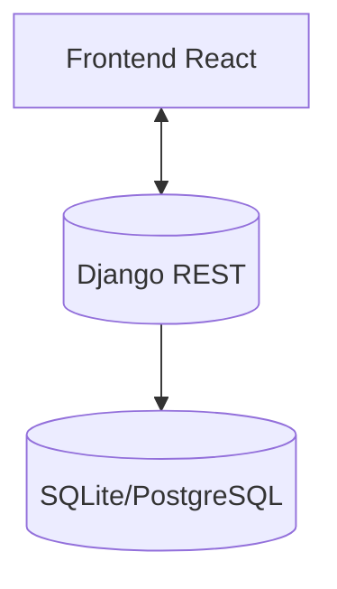

# Backend — Django REST API

Plataforma de reconocimiento de gestos con un backend en Django + Django REST Framework. Expone endpoints para operaciones, almacenamiento y utilidades, con CORS habilitado para el frontend React.

## Tabla de Contenidos

- Arquitectura
- Requisitos
- Instalación
- Estructura de Carpetas
- Librerías usadas
- Configuración (settings)
- Ejecución
- Endpoints y flujo
- Variables de entorno
- Pruebas y utilidades
- Despliegue

## Arquitectura

- Framework: Django
- API: Django REST Framework (DRF)
- CORS: django-cors-headers
- DB: SQLite (dev) / PostgreSQL (prod)
- Autenticación: (opcional) se puede integrar JWT u otra en el futuro



## Requisitos

- Python 3.8+
- pip

## Instalación

```bash
cd backend
python -m venv .venv
# Windows
.venv\Scripts\activate
# Linux/Mac
source .venv/bin/activate

pip install -r requirements.txt
python manage.py migrate
```

## Estructura de Carpetas

```
backend/
├─ operaciones/
│  ├─ models.py        # Modelos de base de datos (si aplica)
│  ├─ views.py         # Vistas DRF (APIView/ViewSet)
│  ├─ urls.py          # Rutas de la app
│  └─ migrations/      # Migraciones
├─ manage.py           # CLI de Django
└─ requirements.txt    # Dependencias del backend
```

### Qué hace cada archivo clave
- `operaciones/models.py`: define entidades persistentes (gestos, sesiones de entrenamiento, etc.).
- `operaciones/views.py`: lógica de endpoints (p.ej. registrar muestras, reconocer gesto, ping).
- `operaciones/urls.py`: mapea los paths hacia las vistas.
- `manage.py`: comandos de arranque y mantenimiento del proyecto.

## Librerías usadas

- `Django`: framework web principal
- `djangorestframework`: construcción de APIs REST
- `django-cors-headers`: CORS para permitir llamadas desde el frontend
- `django-environ`: (opcional) manejo de variables de entorno

Estas se listan en `requirements.txt`.

## Configuración (settings.py)

Asegúrate de incluir:

```python
INSTALLED_APPS = [
    # ...
    'rest_framework',
    'corsheaders',
    'operaciones',
]

MIDDLEWARE = [
    'corsheaders.middleware.CorsMiddleware',
    # ...
]

CORS_ALLOW_ALL_ORIGINS = True  # o especificar lista de orígenes permitidos
```

## Ejecución

```bash
python manage.py runserver
```

Servidor local: http://127.0.0.1:8000/

## Endpoints y Flujo (ejemplos)

- `GET /operaciones/ping/` — salud del servicio
- `POST /operaciones/gestos/` — registra muestras/gestos
- `POST /operaciones/reconocer/` — reconoce gesto actual y devuelve etiqueta/confianza

Flujo general:
1. El frontend solicita/entrena gestos y envía datos al backend (si procede).
2. El backend persiste/ procesa y responde con el resultado de reconocimiento o confirmación de guardado.

## Variables de Entorno

Crea `.env` (opcional):
```
DJANGO_DEBUG=true
DB_URL=sqlite:///db.sqlite3
ALLOWED_HOSTS=127.0.0.1,localhost
```
Usar `django-environ` para cargar.

## Pruebas y utilidades

- Tests: `python manage.py test`
- Crear superusuario: `python manage.py createsuperuser`
- Migraciones: `python manage.py makemigrations && python manage.py migrate`

## Despliegue

- Base de datos: usar PostgreSQL
- Servidor de apps: gunicorn/uvicorn + nginx
- Staticfiles: `collectstatic`
- Seguridad: configurar `ALLOWED_HOSTS`, HTTPS, y CORS restringido
